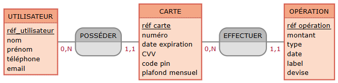

## Développer une mini API REST

### Modélisation de l'API
Voici la liste des endpoints que je vais mettre en place pour l'API demandée:

| Méthode HTTP | Route                       | Action                                                   | Payload                         | Réponse                                                        |  
|--------------|-----------------------------|----------------------------------------------------------|---------------------------------|----------------------------------------------------------------|
| GET          | /users/{id}                 | Récupérer un utilisateur                                 | -                               | { id, name, email }                                            |
| GET          | /tasks/{id}                 | Récupérer une tâche                                      | -                               | { id, user_id, title, description, creation_date, status }     |
| GET          | /users/{id}/tasks           | Récupérer les tâches d'un utilisateur                    | -                               | [ { id, user_id, title, description, creation_date, status } ] |
| POST         | /users/{id}/tasks           | Créer et ajouter une nouvelle tâche pour un utilisateur  | { title, description, status }  | { id, user_id, title, description, creation_date, status }     |
| DELETE       | /tasks/{id}                 | Supprimer une tâche                                      | -                               | -                                                              |

### Prérequis pour l'installation

- Docker et Docker Compose installés

### Installation

- Lancer l'application avec Docker 
```bash
docker-compose up --build
```
- Les scripts d'initialisation et de seeding sont automatiquement exécutés au démarrage des conteneurs
- L'API sera accessible à l'adresse http://localhost:8080

## Hameçon

Pour pouvoir informer le partenaire de manière automatisée, je propose qu'on mette en place un webhook. Il faut que le partenaire ait un endpoint sur lequel envoyer une requête POST avec les données qu'il attend. Et de notre côté, dans notre application, il faut ajouter un écouteur d'évènement qui déclenche cette requête lorsqu'une création de carte se produit.

## Conception d'une base de données SQL pour une banque

### Schéma conceptuel

Pour le schéma conceptuel j'ai choisi le modèle Merise MCD. Voici le MCD que j'ai fait sur le site [Mocodo](https://www.mocodo.net/?mcd=eNpFj00KwjAQRvc5xRxgFrp1V2qEgtjSpm4l2hED-SNNRY_gUXqOXMxQC26G7xuY95heVMeqKwTv2x2ENN8vU1RajTLSFBCsMwg-75cQ06zT7B_OEgIZqTRr6q5Lnz1vETYn6P80hO0WyqIVnC3zR4ebDDEf28mkOTiEIYuAXl4FGZWzCOX5jHBzA4FXuXot784OYMiOE2nGDwdein71LeTFVDfp0xaiqk_sH1en89m14o2zUdqYf3l7-ukRtLySzoWeaiT2BTygX4c=):



### Clés primaires et clés étrangères

Il y a trois clefs primaires (Primary Key):
- réf_utilisateur pour l'entité Utilisateur
- réf_carte pour l'entité Carte
- réf_opération pour l'entité Opération

Il y a deux clefs étrangères (Foreign Key) à déduire des relations et cardinalités:
- Une carte appartient nécessairement à un utilisateur -> l'entité Carte contient une FK utilisateur_réf
- Une opération est nécessairement effectuée avec une carte -> l'entité Opération contient une FK carte_réf

### Exemples de requête SQL

- Insérer un nouveau porteur de carte dans la base de données:

En partant du principe que l'id est auto-incrémenté, on ne le précise pas dans la requête:

```sql
INSERT INTO card_holder (lastname, firstname, phone_number, email)
VALUES ('Doe', 'John', '0601010101', 'john.doe@gmail.com');
```
- Enregistrer une nouvelle opération:

En partant du principe que l'id est auto-incrémenté, on ne le précise pas dans la requête. 

```sql
INSERT INTO operation (amount, type, operated_at, label, currency, card_id) 
VALUES (15000, 'debit', '2025-06-19 01:30:00', 'SNCF Payment', 'EUR', 3);
```